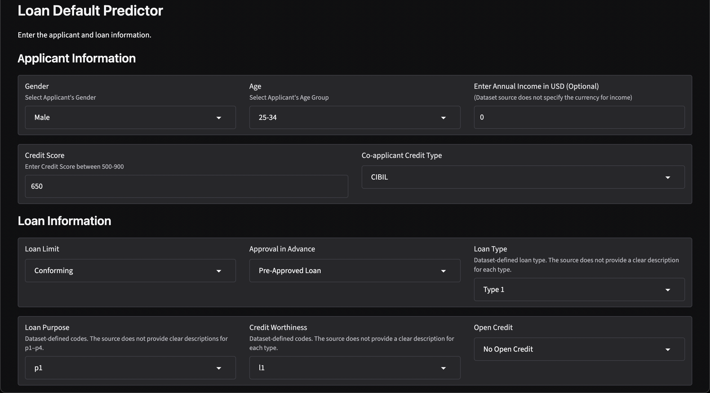
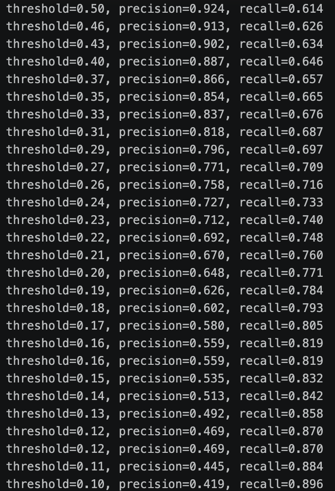
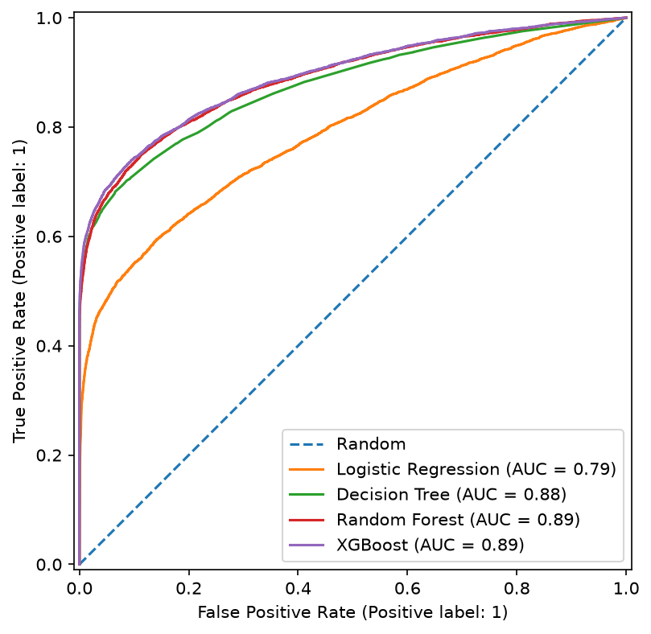

# Loan Default Prediction

> XGBoost model predicting loan default probability, served via FastAPI + Gradio, containerized and deployed on Render.



**Live demo:** https://loan-default-prediction-d6n8.onrender.com/

Note: Render free tier spins down on inactivity — first request after idle may take ~30-60s to wake up.

**Full technical writeup:** [report.md](./reports/report.md)

---

## Table of Contents
- [Overview](#overview)
- [Dataset](#dataset)
- [Results](#results)
- [Project Structure](#project-structure)
- [Setup & Installation](#setup--installation)
- [Running Locally](#running-locally)
- [API Usage](#api-usage)
- [Deployment](#deployment)
- [Tech Stack](#tech-stack)
- [Limitations & Assumptions](#limitations--assumptions)
- [Acknowledgments](#acknowledgments)

---

## Overview

Banks frequently use ML systems to automatically reject loan applications before a human reviews them. Based on this use case, this project receives a loan application and predicts whether the applicant is likely to default.

## Dataset

- Source: https://www.kaggle.com/datasets/yasserh/loan-default-dataset (Kaggle, "Loan Default Classification Problem")
- Size: 148,670 rows x 34 columns
- Target variable: `status` (binary: default / no default)
- The dataset contains a collection of numerical and categorical features related to applicant information like `gender`, `age`, `income`; loan information like `loan_limit`, `loan_type`, `loan_purpose`; and more.
- IMPORTANT — The dataset does not document units/currency for monetary fields; I have inferred USD from context (US region categories, HMDA-style fields) and treated this explicitly rather than assuming it silently. The dataset also has ambiguity in some fields — `loan_type`, for example, is a categorical feature with categories `type1`, `type2`, and `type3`, without explicit documentation of what each category means. I have kept these fields as-is, since a model only needs categorical values to be internally consistent, not human-readable.
- More in-depth details about the leakage features identified and dropped during exploration and more are available in [report.md](./reports/report.md).

## Results

### Key Finding

Feature-importance analysis showed the model leaning heavily on dataset artifacts rather than genuine predictive signal — a missingness indicator and a near-perfect categorical split were each disproportionately influential. After removing the strongest leakage sources, subgroup analysis on the remaining `dtir1_was_missing` flag revealed a stark recall split: a 3.6% false-negative rate when the flag was set, versus 44.7% when it wasn't. Full breakdown in [report.md](./reports/report.md#error-analysis).

### Metrics (test set)

| Metric | Value |
|---|---|
| Model | XGBoost |
| ROC-AUC | 0.890 |
| PR-AUC | 0.834 |
| Precision | 0.706 |
| Recall | 0.735 |
| Accuracy | 0.861 |
| Decision threshold | 0.23 |



- **Why XGBoost?** All four candidate models were tuned to a comparable recall (~74%) on the validation set, then compared on precision and PR-AUC at that matched recall — full comparison in [metrics.json](./reports/metrics.json) or the [technical report](./reports/report.md#evaluation). XGBoost reached that recall with the highest precision and PR-AUC of the four, meaning fewer false alarms for the same rate of caught defaulters.

<br>



## Project Structure

```
loan-default-prediction/
├── data/raw/                 
├── models/
│   ├── final_encoder.pkl            
│   ├── final_medians.pkl
│   ├── final_scaler.pkl           
│   └── final_xgb_model.pkl
├── notebooks/                 
├── reports/
│   ├── figures/
│   │   ├── app.png
│   │   ├── threshold.png
│   │   ├── roc_all_models.png
│   │   ├── missingno.png
│   │   ├── heatmap.png
│   │   ├── leakage.png
│   │   ├── leakage2.png
│   │   └── feature_importance2.png
│   ├── metrics.json
│   └── report.md
├── src/
│   ├── api.py                
│   ├── app.py             
│   ├── data.py             
│   ├── features.py       
│   ├── predict.py               
│   └── train.py  
├── .dockerignore
├── .gitattributes
├── .gitignore            
├── .python-version
├── Dockerfile
├── README.md
├── pyproject.toml
├── start.sh
└── uv.lock
```

## Setup & Installation

```bash
git clone https://github.com/samisiraj/loan-default-prediction
cd loan-default-prediction
uv sync
```

## Running Locally

**Without Docker:**
```bash
./start.sh
```

**With Docker:**
```bash
docker build -t loan-default-prediction .
docker run -p 7860:7860 loan-default-prediction
```

## API Usage

```bash
curl -X POST http://127.0.0.1:8080/predict \
  -H "Content-Type: application/json" \
  -d '{
    "loan_limit": "cf",
    "gender": "male",
    "approv_in_adv": "pre",
    "loan_type": "type1",
    "loan_purpose": "p1",
    "credit_worthiness": "l1",
    "open_credit": "nopc",
    "business_or_commercial": "nob/c",
    "loan_amount": 150000,
    "term": 180,
    "neg_ammortization": "not_neg",
    "interest_only": "not_int",
    "lump_sum_payment": "not_lpsm",
    "property_value": 250000,
    "construction_type": "sb",
    "occupancy_type": "pr",
    "secured_by": "home",
    "total_units": "1u",
    "income": 60000,
    "credit_score": 650,
    "co-applicant_credit_type": "cib",
    "age": "25-34",
    "submission_of_application": "to_inst",
    "ltv": 80.5,
    "region": "north",
    "security_type": "direct",
    "dtir1": 35
  }'
```

### Response:
```json
{
  "default_probability": 0.056,
  "prediction": 0
}
```

## Deployment

- Hosted on Render (free tier), Docker-based deployment
- A single Docker container runs both FastAPI (:8080) and Gradio (:7860) via start.sh.

## Tech Stack

- Python
- XGBoost, scikit-learn
- FastAPI
- Gradio
- Docker
- Render (hosting)

## Limitations & Assumptions

- **Currency assumption:** The dataset does not document a currency or unit for monetary fields (`loan_amount`, `property_value`, `income`, etc.). USD was assumed based on contextual clues — US-style region categories and a categorical field structure resembling HMDA-style mortgage datasets — but this is an inference, not a confirmed fact from the source.
- **Undocumented categorical codes:** Fields like `loan_purpose` (p1–p4), `credit_worthiness` (l1/l2), and `loan_type` (type1–3) are dataset-defined codes with no published meaning. These were kept rather than dropped, since categorical values only need to be internally consistent between training and inference to be useful — the model doesn't need to know what "p1" means, only that it behaves consistently.
- **Decision threshold:** The classification threshold (0.23, below the default 0.5) was chosen to prioritize recall on defaulting applicants over precision — in a lending context, missing an actual defaulting applicant is typically costlier than flagging a safe applicant for review, so the threshold was tuned to catch more true defaults at the cost of more false positives.
- **Hosting:** Deployed on Render's free tier, which spins down after inactivity — the first request after idling may take 30–60 seconds to respond.
- **Dataset scope:** This is a portfolio/learning project built on a single public Kaggle dataset. It has not been validated against real-world lending data, and the class balance, feature distributions, or default patterns may not generalize beyond this dataset.

## Acknowledgments

- Course: [ML Zoomcamp: Free Machine Learning Engineering Course](https://github.com/DataTalksClub/machine-learning-zoomcamp) by DataTalks.Club
- Dataset: [Loan Default Dataset](https://www.kaggle.com/datasets/yasserh/loan-default-dataset) by yasserh on Kaggle
