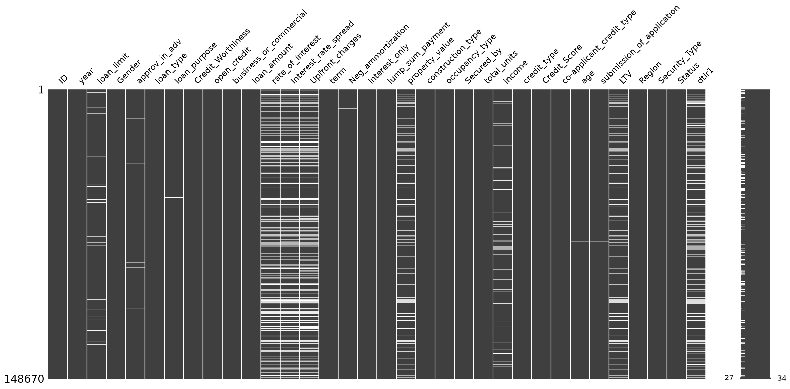
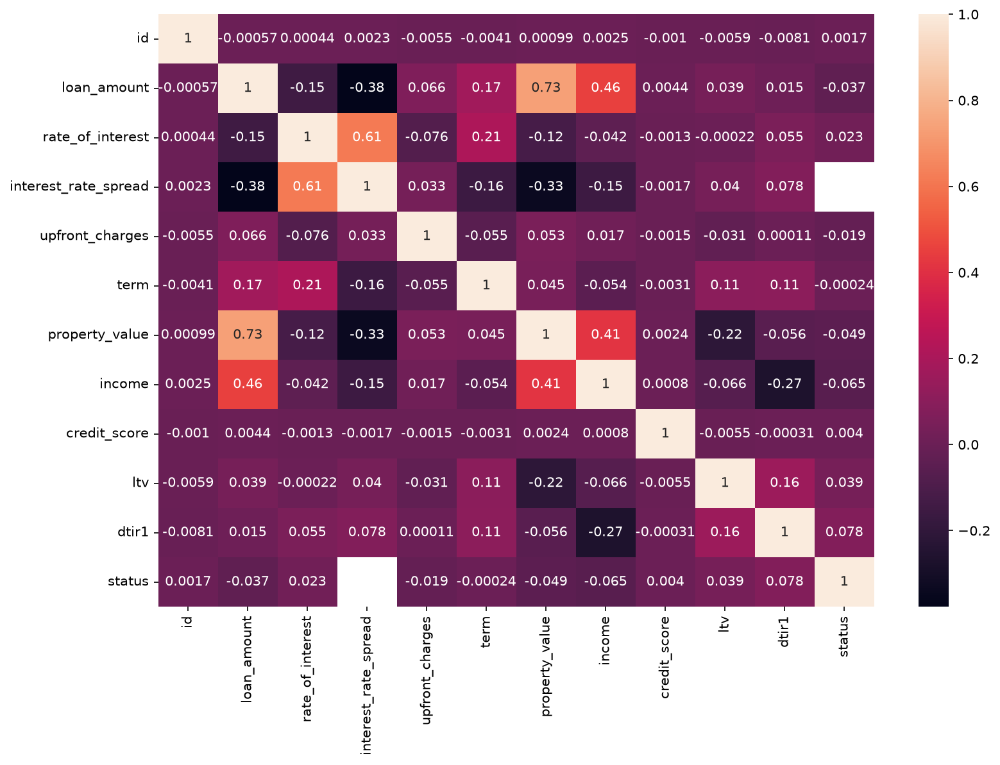
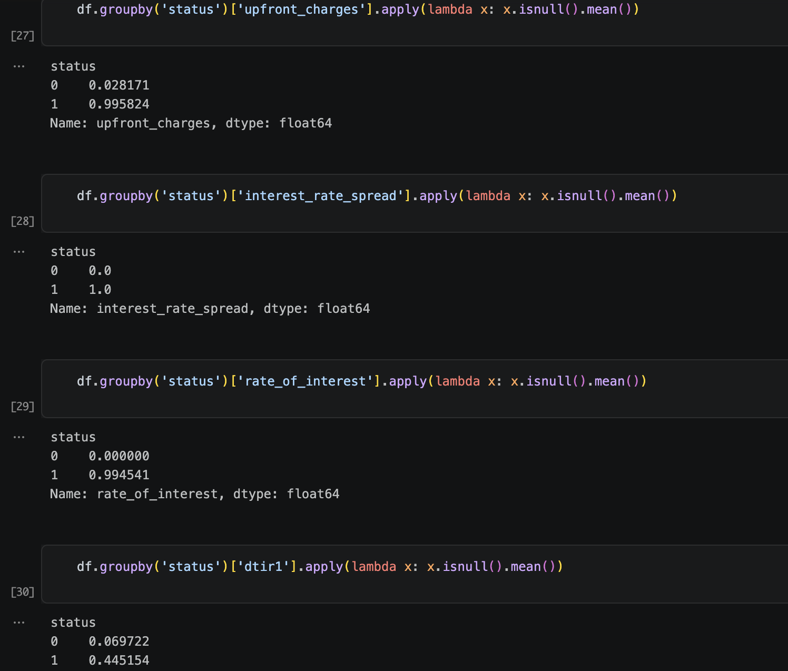
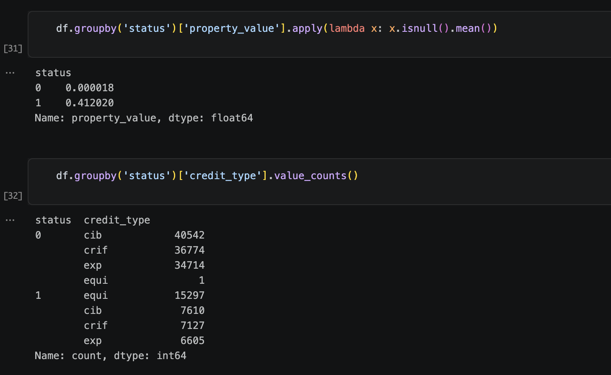
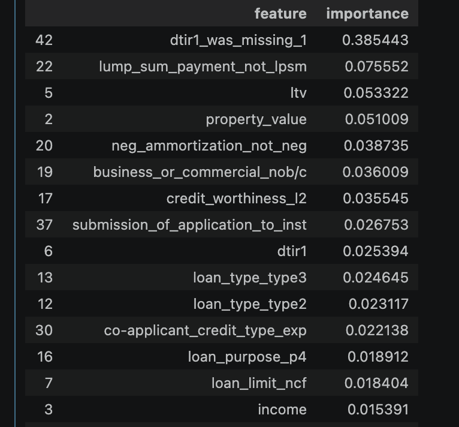

# Loan Default Prediction — Technical Report

## Table of Contents
- [Problem Statement](#problem-statement)
- [Dataset & Exploratory Analysis](#dataset--exploratory-analysis)
- [Data Cleaning & Feature Engineering](#data-cleaning--feature-engineering)
- [Handling Ambiguous Features](#handling-ambiguous-features)
- [Modeling](#modeling)
- [Evaluation](#evaluation)
- [Error Analysis](#error-analysis)
- [From Notebook to Production](#from-notebook-to-production)
- [Serving Architecture](#serving-architecture)
- [Deployment](#deployment)
- [What I'd Do Differently](#what-id-do-differently)
- [Conclusion](#conclusion)

---

## Problem Statement

- This binary classification machine learning project is a personal/learning project. The aim was to predict whether a loan application will end up defaulting or not, based on the features provided by the dataset. The dataset consists of multiple features that represent typical information a loan applicant provides, along with `status` — a binary feature telling us if the applicant defaulted or not. This is our target column, which we trained our machine learning models to classify.
- When a person applies for a loan, banks perform a thorough examination of the applicant's background and their loan requirements, based on which the bank either accepts or rejects the application. Some banks use machine learning algorithms as a first layer of review for the loan application before it reaches a human. This saves banks a lot of time and effort by rejecting a number of applications beforehand without human intervention.
- Lending decisions are heavily based on saving money and lending on a low-risk basis, so the requirement of this project was to identify the applications that have a high chance of defaulting and catch them.

## Dataset & Exploratory Analysis

- Source: https://www.kaggle.com/datasets/yasserh/loan-default-dataset (Kaggle, "Loan Default Classification Problem")
- Size: 148,670 rows x 34 columns
- Features Description: https://www.kaggle.com/datasets/yasserh/loan-default-dataset/discussion/522084
- Missing Data

- Correlation Heatmap

## Data Cleaning & Feature Engineering

- In the [EDA notebook](../notebooks/01_eda.ipynb) I explored the dataset and the missing values in it, and the percentage of missing values for each feature. I categorized the missing data into two types.
1) Features that proportionately had a very low amount of NaNs compared to the whole dataset, like `term`, `upfront_charges`, `credit_type`, `loan_limit`, etc. These columns' NaNs were safely dropped, as they would not reduce the overall size of the dataset significantly. The feature in this category with the largest percentage of NaNs was `loan_limit`, having 2.25% of its values missing.
2) Features that had a higher ratio of missing data, which could not be removed without a significant loss of the dataset, were imputed instead. These features spanned monetary values (`income`, `property_value`) and ratio-based measures (`dtir1`, `ltv`); all were imputed with medians, since median imputation is robust to outliers regardless of the underlying unit.

- So what about the rest of the missing values — specifically `upfront_charges`, `interest_rate_spread`, and `rate_of_interest`? I discovered that these features' missingness itself was a sign of leakage. When I grouped the data by `status` (`1` = defaulted, `0` = did not default), these three features were missing in nearly 100% of defaulted applications and close to 0% of non-defaulted ones.

- Based on this, I removed `upfront_charges`, `interest_rate_spread`, and `rate_of_interest` outright, since keeping them would let the model learn "missing = defaulted" rather than any real underlying signal.

- `credit_type` showed a related but different pattern — not a missing-value leakage pattern, but a near-perfect category split:

This category-imbalance leakage was identified and removed once I explored the feature importance of the XGBoost model, discussed further in [Modeling](#modeling).

- `dtir1` was more nuanced: its missingness wasn't split near-100%-when-defaulted like the three columns above, but grouping by `status` still showed a large gap — `dtir1` was missing in about 6% of non-defaulted applications versus 44% of defaulted ones. Rather than dropping the column, I imputed the missing values with the median and added a `dtir1_was_missing` flag — reasoning that a flag preserves this missingness signal without discarding the column's actual values for applicants where it *was* present. In hindsight, this doesn't remove the leakage risk, it just softens and relocates it: the flag still lets the model learn "flag=1 → more likely to default" directly from an engineered feature rather than a genuine predictive relationship, just less severely than the three missing-value-leakage columns dropped above. I also engineered a `property_value_was_missing` flag on the same reasoning and later dropped it for the same concern, but kept `dtir1_was_missing` due to project-scope constraints — discussed further in [What I'd Do Differently](#what-id-do-differently).

- Finally, to build the feature matrix, all categorical features were one-hot-encoded and all numerical features were scaled using a standard scaler.

## Handling Ambiguous Features

- I checked the Kaggle dataset page directly and confirmed no currency is documented. Based on contextual clues — US-style region categories (`north`, `south`, `central`) and a categorical field structure resembling HMDA-style US mortgage data — I assumed USD.

- Worth being precise about what this assumption does and doesn't protect against: the Pydantic validation bounds on `loan_amount`, `property_value`, and `income` were derived from the training data's own numeric range, so they're internally consistent regardless of what the true currency actually is — a real loan amount in whatever the actual currency is will pass validation, because the bounds were fit to that same data. What the bounds *can't* catch is a mislabeled unit: if the true currency isn't USD, the app still validates and predicts normally, it just does so under an incorrect label — a user trusting "USD" would have no way to know the number they're entering is being interpreted in a different real-world currency than they intended. The dataset almost certainly does use *some* real, consistent currency throughout; USD is my best inference for which one, not a verified fact, and the failure mode of being wrong is silent mislabeling, not a validation error.

## Modeling

- I trained 4 different models on this dataset: `logistic regression`, `decision tree`, `random forest`, and `XGBoost`.
- To test the basic performance of each model, I initially trained it without any hyperparameter tuning. After getting a base model and an initial ROC-AUC score, I ran hyperparameter tuning on all models — using `GridSearchCV` for logistic regression and decision tree, and `RandomizedSearchCV` for random forest and XGBoost.
- On exploring feature importance, I found that `credit_type_equi` was contributing 47% to the best XGBoost model's output, `property_value_was_missing` was contributing 31%, and `dtir1_was_missing` was contributing 3.6%. `credit_type_equi` was only one one-hot-encoded category of the original `credit_type` column, but since the leakage lived in `credit_type` itself — a near-perfect category split rather than a missingness pattern — all of its encoded categories were equally suspect, not just this one; dropping only `credit_type_equi` would have left the rest of `credit_type`'s encoded categories in the feature matrix, still carrying the same risk, so the entire source column was dropped. `property_value_was_missing` was dropped for the same underlying reason as the missing-value-leakage columns identified earlier: its 31% importance was disproportionate enough to indicate the model was leaning on missingness itself rather than genuine signal. `dtir1_was_missing`, by contrast, sat at a much lower 3.6% importance, which is part of why it was kept rather than dropped at this stage — a decision revisited in the [Error Analysis](#error-analysis) section.

- Notebook to explore this section: [Modelling Notebook](../notebooks/03_modelling.ipynb)

- Models were retrained on a final, leakage-free feature matrix. ROC curves for all retrained models are recorded here: [ROC AUC](./figures/roc_all_models.png)

## Evaluation

Before finalizing the model, all four candidates were compared on the **validation set**, with each model's classification threshold individually tuned to reach a comparable recall of roughly 74% on the default class — since missing an actual defaulter (a false negative) is typically costlier in a lending context than flagging a safe applicant for extra review (a false positive). Comparing all four models at matched recall gives a fairer view of which model handles that tradeoff most efficiently:

| Model | Threshold | Precision | Recall | F1 | PR-AUC |
|---|---|---|---|---|---|
| XGBoost | 0.23 | 0.712 | 0.740 | 0.726 | 0.8372 |
| Random Forest | 0.25 | 0.688 | 0.744 | 0.715 | 0.8295 |
| Decision Tree | 0.20 | 0.637 | 0.742 | 0.686 | 0.8122 |
| Logistic Regression | 0.18 | 0.410 | 0.736 | 0.527 | 0.6829 |

At matched recall (~74%), XGBoost reaches that recall with the highest precision (71.2%) and the best PR-AUC of the four — meaning that for the same rate of caught defaulters, it produces meaningfully fewer false alarms than the other models, especially logistic regression, whose precision collapses to 41% to hit the same recall level. XGBoost was selected as the final model on this basis, keeping its validation-tuned threshold of 0.23.

PR-AUC is the more informative metric than ROC-AUC here because the dataset is imbalanced — roughly 75.4% of applicants did not default versus 24.6% who did. ROC-AUC can look deceptively strong on imbalanced data, since it credits the model for correctly identifying true negatives, which are comparatively easy to get right when the negative class dominates. PR-AUC focuses specifically on how well the model handles the positive (default) class, which is the class that actually matters for a lending-risk use case.

With the model and threshold fixed from validation, final performance was confirmed on the held-out **test set**:

| Metric | Value |
|---|---|
| ROC-AUC | 0.8900 |
| PR-AUC | 0.8335 |
| Precision | 0.7060 |
| Recall | 0.7349 |
| Accuracy | 0.8613 |

These test-set numbers sit close to the validation-set results (PR-AUC 0.8335 vs. 0.8372, recall 0.7349 vs. 0.740, precision 0.7060 vs. 0.712) — a small, expected drop rather than a large one, which is a reasonable sign the model and threshold generalize beyond the validation set rather than being overfit to it.

- Notebook to explore this section: [Error Analysis Notebook](../notebooks/04_comapre_and_error_analysis.ipynb)

## Error Analysis

### Headline finding: an uneven recall split around `dtir1_was_missing`

Feature importance on the final model showed `dtir1_was_missing` contributing 38.5% — by far the single largest contributor, well ahead of the next feature (`lump_sum_payment_not_lpsm` at 7.6%). This matched the concern raised in [Modeling](#modeling): the model was leaning heavily on this engineered flag, disproportionate to how mild the underlying missingness gap actually was (6% vs. 44%, see [Data Cleaning](#data-cleaning--feature-engineering)) compared to the near-total splits seen in the three columns dropped outright for leakage.

To understand what this reliance actually looked like in practice, I isolated false negatives — actual defaulters the model failed to catch — and split them by whether `dtir1` was missing:

| Segment | False Negative Rate | n (actual defaulters) |
|---|---|---|
| Overall (test set) | 26.5% | — |
| `dtir1_was_missing = 1` | 3.6% | 3,097 |
| `dtir1_was_missing = 0` | 44.7% | 3,894 |

The gap is stark and goes in a direction worth being precise about: the model isn't uniformly worse at handling missing `dtir1` — it's the opposite. When `dtir1` is missing, the model catches defaulters far better than baseline (3.6% FN rate vs. 26.5% overall). When `dtir1` is present, the model performs meaningfully worse than baseline (44.7% FN rate). In effect, the model has learned to treat the missingness flag itself as a near-decisive signal for default, at the cost of paying less attention to the applicant's actual financial features when the flag isn't present.

This is the concrete, measurable version of the leakage concern raised earlier: rather than learning a distributed, generalizable pattern across an applicant's real financial profile, a large share of the model's discriminative power is concentrated in one engineered proxy for missingness. That's a fragile foundation — it performs well on this test set specifically because the same missingness mechanism that existed in training also exists in this held-out data, but it offers no guarantee of holding up on a genuinely new population where that mechanism might differ or not exist at all.

### Ruling out an alternative explanation

Before concluding the recall gap was specifically about `dtir1_was_missing`, I checked whether it could instead be explained by a different subgroup — for instance, whether applicants with `gender = joint` and `loan_purpose = p4` (a pattern that appeared repeatedly among the lowest-confidence false negatives) were driving the gap instead:

| Segment | False Negative Rate | n |
|---|---|---|
| Overall | 26.5% | — |
| `gender = joint`, `loan_purpose = p4` | 27.8% | 526 |

This subgroup's FN rate was close to the overall baseline, ruling it out as a meaningful driver. The `dtir1_was_missing` split, by contrast, showed a much larger and more consistent deviation from baseline in both directions — supporting that the missingness flag itself, not some other correlated applicant characteristic, is the actual mechanism behind the recall imbalance.

### What I'd do about it

Given the project's time constraints, `dtir1_was_missing` was kept rather than removed at this stage (see [Data Cleaning](#data-cleaning--feature-engineering) and [What I'd Do Differently](#what-id-do-differently)). The honest tradeoff: this keeps the model's aggregate ROC-AUC/PR-AUC numbers high, but the model's real-world reliability is uneven across a segment defined by a feature that is itself a leakage artifact, not a genuine applicant characteristic — a materially different risk profile than the headline metrics alone suggest.

## From Notebook to Production

The trained model, encoder, scaler, and per-column medians were exported directly from the training notebook using `joblib`, rather than re-deriving any preprocessing logic at serving time. This matters because it guarantees the exact same fitted transformations seen during training are applied at inference — no risk of the serving code accidentally re-fitting an encoder on different categories, computing a different median, or scaling with different parameters than what the model was actually trained on. Any mismatch here would be silent: the API would still return a prediction, just a wrong one, with no error to signal it.

`features.py`'s `clean_data` and `prepare_data` were both written exclusively for training-time use and can't run on inference input at all. `clean_data` drops rows with nulls in low-missingness columns — safe across a full training set, but destructive on a single-row request: at inference time a request is exactly one row, and if that row has a null in any of those columns, `dropna()` doesn't impute or flag it, it silently drops the entire row, leaving an empty dataframe for the rest of the pipeline to fail on. `prepare_data` additionally requires a `status` column to return `y`, which doesn't exist for a live prediction request. Rather than adapting these functions to handle both cases, I wrote `predict.py`'s preprocessing as its own function, largely copied and adapted from this same logic (same `cat_columns`/`num_columns`, same `np.hstack` pattern) but stripped of the training-only assumptions. This works, but it means the two pipelines are maintained separately by hand — a shared, single preprocessing pipeline usable by both training and serving is the cleaner fix, and is listed under [What I'd Do Differently](#what-id-do-differently).

## Serving Architecture

Input validation is handled by a Pydantic model (`LoanApplication`) whose field bounds mirror the actual observed ranges in the training data, rejecting out-of-range or malformed requests before they ever reach the model. One field, `co-applicant_credit_type`, uses a Pydantic alias to accommodate its hyphenated name, since Python identifiers can't contain hyphens directly.

The backend is a FastAPI service exposing two endpoints: `/predict`, which accepts a `LoanApplication` payload and returns a default probability and binary prediction, and `/ping`, a basic health check. The user-facing frontend is a Gradio app, which collects the same inputs through a form and calls the FastAPI backend internally over HTTP rather than duplicating any prediction logic on the frontend side.

## Deployment

The FastAPI backend and Gradio frontend are packaged into a single Docker container, with a `start.sh` script launching `uvicorn` in the background and the Gradio app in the foreground. Both processes communicate over `127.0.0.1` inside the same container. This was a deliberate architectural choice over splitting the two into separately deployed services: a combined container avoids cross-service networking and CORS configuration entirely, which is unnecessary complexity for a solo project at this stage, at the cost of losing independent scalability between the two components.

The app is deployed on Render's free Docker-based web service tier. It reads its port from a `PORT` environment variable at runtime (`server_port=int(os.getenv("PORT", 7860))`) rather than a hardcoded value, since Render (and most cloud hosts) inject their own port assignment at deploy time.

A known limitation of the free tier: the service spins down after a period of inactivity, so the first request after idling can take 30–60 seconds to respond while it wakes back up.

## What I'd Do Differently

The clearest lesson from this project is that I should have questioned the scale and unit of numeric fields like `loan_amount` at the very start of EDA, not after a model was already trained on them. By the time I discovered the currency ambiguity, I was already invested in the feature as-is, which made it harder to treat the question with the objectivity it deserved. Going forward, I'd explicitly check every user-facing numeric column for two things before any feature engineering begins: whether I understand what it represents, and separately, whether I know its scale or unit well enough that a future user supplying a value would interpret it the same way the training data did.

The `dtir1_was_missing` leakage tradeoff is the second thing I'd revisit with more time: rather than keeping the flag due to project-scope constraints, I'd want to test the model's performance with it fully removed, and quantify exactly how much aggregate metric performance is lost versus how much more even the recall becomes across the segment currently affected by the imbalance (see [Error Analysis](#error-analysis)).

Beyond that, I'd add automated tests around `predict.py`'s preprocessing function to catch train/serve mismatches early, add basic logging/monitoring to the deployed API to track prediction distributions over time, and formalize the model comparison process (currently manual, per-notebook) into a reusable evaluation script.

## Conclusion

This project took a real, messy dataset — undocumented units, unlabeled categorical codes, and multiple forms of target leakage — through EDA, cleaning, model comparison, error analysis, and a working deployed service, while treating every ambiguous or risky assumption as something to surface and document rather than quietly resolve. The result is a full pipeline: a tuned XGBoost model (test ROC-AUC 0.890, PR-AUC 0.834) served through a validated API and a public demo, with the known limitations and remaining tradeoffs stated plainly rather than hidden. Next steps would focus on closing the `dtir1_was_missing` leakage gap properly and adding the operational scaffolding (tests, logging, CI/CD) needed to move this from a portfolio project toward something closer to production-grade.
